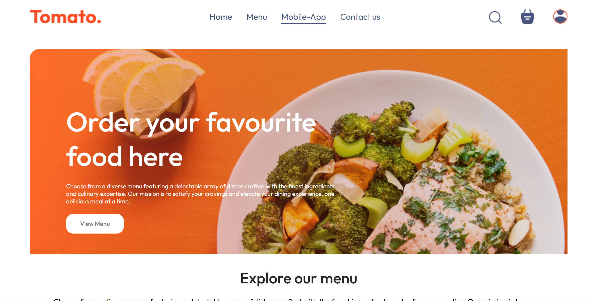
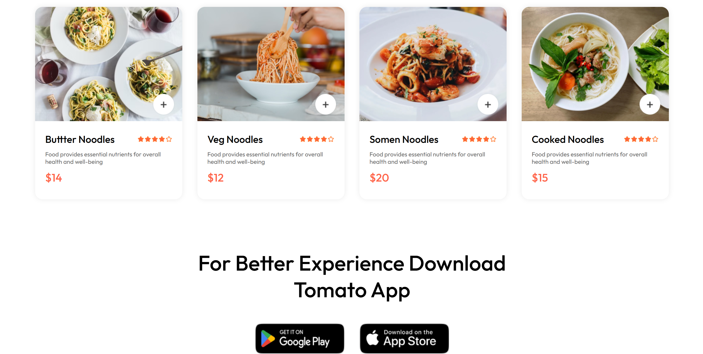
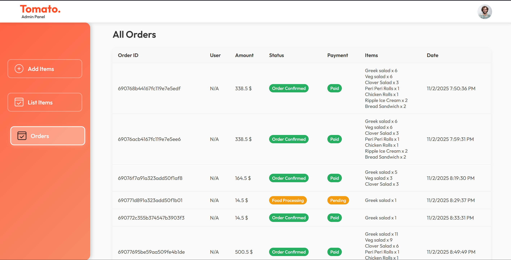

# 🍴 **FeastHut — Food Delivery Web App**


> **FeastHut** — “Delivering smiles, one bite at a time.”  
> A full-stack **MERN Food Delivery Application** featuring secure authentication, image uploads, online payments, and an elegant, responsive UI.

---

## 🌐 **Live Demo**
🚀 [Visit FeastHut (Demo Link)](https://your-live-demo-link.com) - Not deployed yet

---

## 🖼️ **Screenshots**

  
  
  

---

## 🧠 **About the Project**

FeastHut is a complete food delivery platform where users can:
- Browse restaurants and dishes 🍔  
- Add items to the cart 🛒  
- Place and track orders in real-time 📦  
- Make secure online payments 💳  
- Admins can manage menu, orders, and users 👨‍💻  

This project is built using the **MERN Stack** with **Vite + React 19** for blazing performance.

---

## ⚙️ **Tech Stack**

| Layer | Technology |
|-------|-------------|
| Frontend | React 19, Vite, Axios, React Router DOM, React Toastify, SweetAlert2 |
| Backend | Node.js, Express.js, Mongoose |
| Database | MongoDB Atlas |
| Auth | JWT + bcryptjs |
| File Upload | Multer |
| Payment | Stripe / Razorpay |
| Hosting | Vercel (Client) & Render (Server) |

---

## 🧩 **Core Features**

✅ Secure **Login / Signup** with JWT  
✅ **Admin Dashboard** for restaurant & order management  
✅ **Image Uploads** using Multer  
✅ **Online Payments** (Stripe Integration)  
✅ **Cart & Checkout Flow**  
✅ **Order History & Tracking**  
✅ Fully **Responsive UI** with Tailwind CSS  
✅ **RESTful API** architecture  


---

## 🔑 Features

✅ User Authentication (JWT-based Login & Signup)  
✅ Browse Restaurants & Food Categories  
✅ Add to Cart & Checkout Functionality  
✅ Secure Payments Integration  
✅ Order Management System  
✅ Admin Dashboard for Managing Menu, Orders, and Users  
✅ Real-time Notifications (Toast & Alerts)  
✅ Mobile Responsive Design  

---

## 🧠 Environment Variables

Create a `.env` file inside the `/backend` folder and add:

```env
PORT=4000
MONGO_URI=your_mongodb_connection_string
JWT_SECRET=your_secret_key

```
---

## ⚡ Installation & Setup

### 🧭 Clone the repository
```bash
git clone https://github.com/<your-username>/FeastHut.git
cd FeastHut

```
### 💼 Further Instructions
``` bash
# All Once Together (Root)
npm run dev (using concurrently would start all the servers) 

# Backend (Manually)
cd backend
npm install

# Frontend (Manually)
cd ../frontend
npm install

# Admin Panel (Manually)
cd ../admin
npm install

# Run backend server
cd backend
npm run dev

# Run frontend
cd ../frontend
npm run dev

# Run admin panel
cd ../admin
npm run dev

